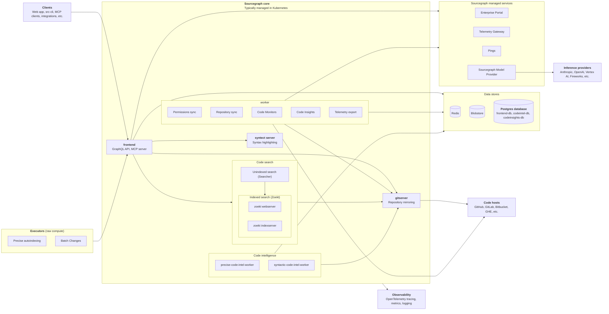
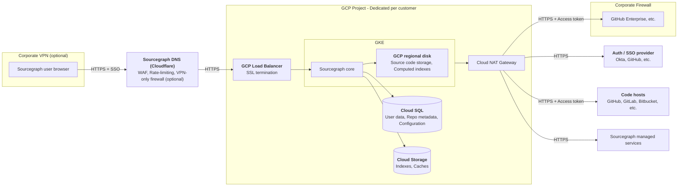
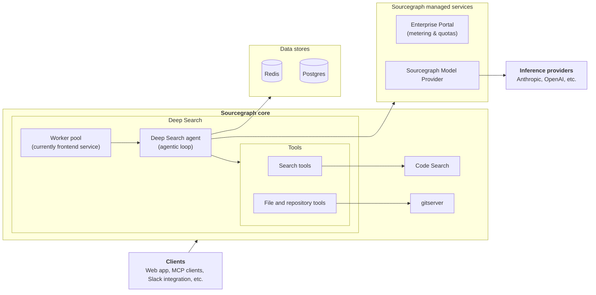
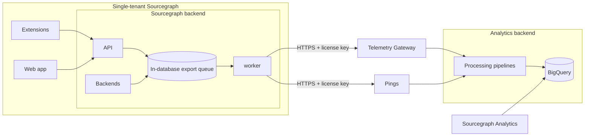

# Sourcegraph architecture

	This document provides a high-level overview of Sourcegraph's architecture
	so you can understand how our systems fit together.

## Overview

## Deployment

### Sourcegraph Cloud

Sourcegraph Cloud is the best way to experience Sourcegraph Enterprise with all the features that come with the Sourcegraph platform. Sourcegraph Cloud customers get private, dedicated, SOC 2 Type II accredited instances provisioned and managed by a dedicated team of Sourcegraph experts. We maintain 24x7x365 incident response and an uptime SLA.

Sourcegraph Cloud instances are single-tenant, limiting exposure to outages and security risks to individual instances. Each customer instance is isolated in a dedicated and fully segregated GCP project.

<Callout type="note">
	Learn more in the [Sourcegraph Cloud docs](/cloud).
</Callout>

### Sourcegraph self-hosted

For customers with specific needs, a variety of self-hosted deployment methods are available.

<Callout type="note">
	Learn more in the [Sourcegraph self-hosted docs](/self-hosted).
</Callout>

## Core features

### Code Search

Developers can search for the entire codebase that is connected to their Sourcegraph instance.

By default, Sourcegraph uses `zoekt` to create a trigram index of the default branch of every repository, which makes searches fast. This trigram index is why Sourcegraph search is more powerful and faster than what is usually provided by code hosts.

Sourcegraph also has a fast search path for code that isn't indexed yet or will never be indexed (for example, code that is not on a default branch). Indexing every branch of every repository isn't a pragmatic use of resources for most customers, so this decision balances optimizing the common case (searching all default branches) with space savings (not indexing everything). This is handled by the `searcher` non-indexed search service.

Note that all product features also [export telemetry](#analytics-and-telemetry).

<Callout type="note">
	Learn more in the [Code Search docs](/code-search).
</Callout>

### Deep Search

Deep Search is an agentic code search tool that understands natural language questions about your codebase. Under the hood, Deep Search is an AI agent that uses various tools to generate its answer. The tools are functionalities available in Sourcegraph.

<Callout type="note">
	Learn more in the [Deep Search docs](/deep-search).
</Callout>

Note that all product features also [export telemetry](#analytics-and-telemetry).

<Callout type="warning">
	Deep Search is undergoing active development, and its architecture is
	rapidly changing.
</Callout>

### Code Navigation

Unlike Search (which is completely text-based), Code Navigation surfaces data such as doc comments for a symbol and actions such as the "go to definition" or "find references" features based on our semantic understanding of code.

By default, Sourcegraph provides [search-based code navigation](/code-navigation/search-based-code-navigation). This reuses all the architecture that makes search fast, but it can result in false positives (for example, finding two definitions for a symbol or references that aren't actually references) or false negatives (for example, not being able to find the definition or all references). This is the default because it works with no extra configuration and is good for many use cases and languages.

With some setup, customers can enable [precise code navigation](/code-navigation/precise-code-navigation). Repositories add a step to their build pipeline that computes the index for that code revision and uploads it to Sourcegraph. This provides precise results that search-based code navigation cannot.

Note that all product features also [export telemetry](#analytics-and-telemetry).

<Callout type="note">
	Learn more in the [Code Navigation docs](/code-navigation).
</Callout>

### Batch Changes

Batch Changes creates and manages large-scale code changes across projects, repositories, and code hosts.

To create a batch change, users write a [batch spec](/batch-changes/batch-spec-yaml-reference), which is a YAML file that specifies the changes that should be performed and the repositories that they should be performed upon — either through a Sourcegraph search or by declaring them directly. This spec is then executed by [src-cli](/cli/references/batch) on the user's machine, in CI or some other environment controlled by the user, or directly within the Sourcegraph UI by enabling Server-Side Batch Changes via executors. This results in changeset specs that are sent to Sourcegraph. Sourcegraph then applies these changeset specs to create one or more changesets per repository. (Depending on the code host, a changeset is a pull request or merge request.)

Once created, Sourcegraph monitors changesets, and their current review and CI status can be viewed on the batch change page. This provides a single pane of glass view of all the changesets created as part of the batch change. The batch change can be updated at any time by re-applying the original batch spec: this will transparently add or remove changesets in repositories that now match or don't match the original search as needed.

Note that all product features also [export telemetry](#analytics-and-telemetry).

<Callout type="note">
	Learn more in the [Batch Changes docs](/batch-changes).
</Callout>

### Code Insights

Code Insights surface higher-level, aggregated information to leaders in engineering organizations in dashboards. For example, code insights can track the number of matches of a search query over time, the number of code navigation diagnostic warnings in a codebase, or the usage of different programming languages. Sample use cases for this are tracking migrations, the usage of libraries across an organization, tech debt, code base health, and much more.

Code Insights persist in a separate database called `codeinsights-db`. The web application interacts with the backend through a [GraphQL API](/api/graphql).

Code Insights uses data from the `frontend` database for repository metadata and repository permissions to filter time series data.

Note that all product features also [export telemetry](#analytics-and-telemetry).

<Callout type="note">
	Learn more in the [Code Insights docs](/code-insights).
</Callout>

### Code Monitoring

Code Monitoring allows users to get notified of changes to their codebase.

Configured Code Monitors run in the `worker` service. The **trigger** is a search query executed to look for new data; if there is new data, we call this an event. The monitor's configured **actions** are run when this query returns a non-zero number of results.

Note that all product features also [export telemetry](#analytics-and-telemetry).

<Callout type="note">
	Learn more in the [Code Monitoring docs](/code-monitoring).
</Callout>

## Repositories

### Repository syncing

At its core, Sourcegraph maintains a persistent cache of all repositories that are connected to it. It is persistent because this data is critical for Sourcegraph to function. Still, it is ultimately a cache because the code host is the source of truth, and our cache is eventually consistent.

- `gitserver` is the sharded service that stores repositories and makes them accessible to other Sourcegraph services
- `worker` is responsible for ensuring all repositories in gitserver are as up-to-date as possible while respecting code host rate limits. It is also responsible for syncing repository metadata from the code host that is stored in the repo table of our Postgres database

### Permission syncing

Repository permissions are mirrored from code hosts to Sourcegraph by default. This builds the foundation of Sourcegraph authorization for repositories to ensure users see consistent content on code hosts. Currently, the background permissions syncer resides in the `worker` service.

<Callout type="note">
	Learn more in the [Permission Syncing docs](/admin/permissions/syncing).
</Callout>

## Supporting features

### Model Provider

The **Sourcegraph Model Provider** is the default and recommended way to configure AI features like Deep Search and Cody. Through this service, we provide zero-configuration access to state-of-the-art models from various LLM providers, including Anthropic and OpenAI, with enterprise-grade [privacy and security](../model-provider/index.mdx#privacy-and-security).

<Callout type="note">
	Learn more in the [Sourcegraph Model Provider docs](/model-provider).
</Callout>

[Cody](/cody) customers have access to [model configuration](../cody/enterprise/model-configuration.mdx) for bypassing the Sourcegraph Model Provider to use inference providers directly.

### Analytics and telemetry

Understanding how individuals and organizations use Sourcegraph is key to providing the highest level of support to Sourcegraph's customers. To enable this, Sourcegraph collects several types of usage data from Sourcegraph instances by having Sourcegraph instances emit telemetry from most product capabilities.

The data we collect powers the [Sourcegraph Analytics service](../analytics/index.mdx).

We take sensitive data/PII exfiltration, intentional or not, very seriously. Our [Telemetry docs](./telemetry.mdx) outline some of the measures we take to ensure privacy and data security.

Telemetry is exported through the `worker` service to the Sourcegraph-managed "Telemetry Gateway" service and "Pings" service, for telemetry events and aggregated reports, respectively.

<Callout type="note">
	Learn more in the [Sourcegraph Analytics docs](/analytics) and [Telemetry
	docs](/admin/telemetry).
</Callout>

### Enterprise Portal

Sourcegraph Enterprise Portal is the Sourcegraph-managed service for viewing your enterprise subscription and managing user access to Sourcegraph operated services.

Enterprise Portal also handles Sourcegraph licensing and metering. Sourcegraph will reach out to the Enterprise Portal service to perform license verification checks, and also for metered capabilities like [Deep Search](#deep-search).

<Callout type="note">
	Learn more in the [Sourcegraph Enterprise Portal
	docs](/admin/enterprise-portal).
</Callout>

### Observability

Observability encapsulates the monitoring and debugging of Sourcegraph deployments. Sourcegraph is designed and ships several observability tools and out-of-the-box capabilities to enable visibility into the health and state of a Sourcegraph deployment.

<Callout type="note">
	<a href="#sourcegraph-cloud">Sourcegraph Cloud</a> is a fully managed
	product, so Sourcegraph Cloud customers are not provided access to
	observability components. Instead, a dedicated team of Sourcegraph experts
	use specialised observability tools to maintain 24x7x365 incident response
	and an uptime SLA for Sourcegraph Cloud customers.
</Callout>

Monitoring includes [metrics and dashboards](/self-hosted/observability/metrics), [alerting](/self-hosted/observability/alerting), and [health checking](/self-hosted/observability/health-checks) capabilities.

- `grafana` is the frontend for service metrics and ships with customized dashboards for Sourcegraph services
- `prometheus` handles the scraping of service metrics and ships with recording rules, alert rules, and alerting capabilities
- `otel-collector` ingests [OpenTelemetry](https://opentelemetry.io/) data, primarily traces
- `cadvisor` provides per-container performance metrics (scraped by Prometheus) in most Sourcegraph environments
- Each Sourcegraph service provides health checks

Debugging includes [tracing](/self-hosted/observability/tracing) and [logging](/self-hosted/observability/logs).

<Callout type="note">
	Learn more in the [Observability docs](/self-hosted/observability).
</Callout>
