# Sourcegraph architecture

	This document provides a high-level overview of Sourcegraph's architecture
	so you can understand how our systems fit together.

## Diagram

## Repository syncing

At its core, Sourcegraph maintains a persistent cache of all repositories that are connected to it. It is persistent because this data is critical for Sourcegraph to function. Still, it is ultimately a cache because the code host is the source of truth, and our cache is eventually consistent.

- `gitserver` is the sharded service that stores repositories and makes them accessible to other Sourcegraph services
- `worker` is responsible for ensuring all repositories in gitserver are as up-to-date as possible while respecting code host rate limits. It is also responsible for syncing repository metadata from the code host that is stored in the repo table of our Postgres database

## Permission syncing

Repository permissions are mirrored from code hosts to Sourcegraph by default. This builds the foundation of Sourcegraph authorization for repositories to ensure users see consistent content on code hosts. Currently, the background permissions syncer resides in the `worker`.

<Callout type="note">
	Learn more in the [Permission Syncing docs](/admin/permissions/syncing)
</Callout>

## Settings cascade

Sourcegraph offers the flexibility of customizing user settings. A single user's settings are generally the result of merging user settings, organization settings, and global settings. Each of these is referred to as a settings subject, which is part of the settings cascade. They are all exposed to GraphQL.

## Search

Developers can search for the entire codebase that is connected to their Sourcegraph instance.

By default, Sourcegraph uses `zoekt` to create a trigram index of the default branch of every repository, which makes searches fast. This trigram index is why Sourcegraph search is more powerful and faster than what is usually provided by code hosts.

- [zoekt-indexserver](https://sourcegraph.com/github.com/sourcegraph/zoekt/-/tree/cmd/zoekt-sourcegraph-indexserver)
- [zoekt-webserver](https://sourcegraph.com/github.com/sourcegraph/zoekt/-/tree/cmd/zoekt-webserver)

Sourcegraph also has a fast search path for code that isn't indexed yet or will never be indexed (for example, code that is not on a default branch). Indexing every branch of every repository isn't a pragmatic use of resources for most customers, so this decision balances optimizing the common case (searching all default branches) with space savings (not indexing everything).

- `searcher` implements the non-indexed search
- Syntax highlighting for any code view, including search results, is provided by `Syntect` server

<Callout type="note">
	Learn more in the [Code Search docs](/code-search)
</Callout>

## Code Navigation

Unlike Search (which is completely text-based), Code Navigation surfaces data such as doc comments for a symbol and actions such as the "go to definition" or "find references" features based on our semantic understanding of code.

By default, Sourcegraph provides [search-based code navigation](/code-navigation/search-based-code-navigation). This reuses all the architecture that makes search fast, but it can result in false positives (for example, finding two definitions for a symbol or references that aren't actually references) or false negatives (for example, not being able to find the definition or all references).

This is the default because it works with no extra configuration and is good for many use cases and languages. We support many languages this way because it only requires writing a few regular expressions.

With some setup, customers can enable [precise code navigation](/code-navigation/precise-code-navigation). Repositories add a step to their build pipeline that computes the index for that code revision and uploads it to Sourcegraph. We must write language-specific indexers, so adding precise code navigation support for new languages is a non-trivial task.

<Callout type="note">
	Learn more in the [Code Navigation docs](/code-navigation)
</Callout>

### Dependencies

- Search: Symbol search is used for basic code navigation
- Sourcegraph extension API: Hover and definition providers
- Native integrations (for code hosts): UI of hover tooltips on code hosts

## Batch Changes

Batch Changes creates and manages large-scale code changes across projects, repositories, and code hosts.

To create a batch change, users write a [batch spec](/batch-changes/batch-spec-yaml-reference), which is a YAML file that specifies the changes that should be performed and the repositories that they should be performed upon — either through a Sourcegraph search or by declaring them directly. This spec is then executed by [src-cli](/cli/references/batch) on the user's machine, in CI or some other environment controlled by the user, or directly within the Sourcegraph UI by enabling Server-Side Batch Changes via executors. This results in changeset specs that are sent to Sourcegraph. Sourcegraph then applies these changeset specs to create one or more changesets per repository. (Depending on the code host, a changeset is a pull request or merge request.)

Once created, Sourcegraph monitors changesets, and their current review and CI status can be viewed on the batch change page. This provides a single pane of glass view of all the changesets created as part of the batch change. The batch change can be updated at any time by re-applying the original batch spec: this will transparently add or remove changesets in repositories that now match or don't match the original search as needed.

Read the [Batch Changes](/batch-changes) docs to learn more.

### Dependencies

- src-cli: Batch changes are currently executed client-side through the `src` CLI
- Search: Repositories in which batch specs need to be executed are resolved through the search API

## Code Insights

Code Insights surface higher-level, aggregated information to leaders in engineering organizations in dashboards. For example, code insights can track the number of matches of a search query over time, the number of code navigation diagnostic warnings in a codebase, or the usage of different programming languages. Sample use cases for this are tracking migrations, the usage of libraries across an organization, tech debt, code base health, and much more.

Code Insights persist in a separate database called `codeinsights-db`. The web application interacts with the backend through a [GraphQL API](/api/graphql).

Code Insights uses data from the `frontend` database for repository metadata and repository permissions to filter time series data.

Code Insights can generate data in the background or just-in-time when viewing charts. This decision is currently enforced in the product, depending on the type and scope of the insight. For code insights being run just-in-time in the client, the performance of code insights is bound to the performance of the underlying data source. These insights are relatively fast as long as the scope doesn't include many repositories (or large monorepos), but performance degrades when trying to include a lot of repositories. Insights that are processed in the background are rate-limited and will perform approximately 28,000 queries per hour when fully saturated on default settings.

There is also a feature flag left over from the original development of the early-stage product that we retained in case a customer who doesn't purchase it ever has a justified need to disable insights. You can set `"experimentalFeatures": { "codeInsights": false }` in your settings to disable insights.

You can learn more in the [Code Insights](/code-insights) docs.

### Dependencies

- Search:
    - GraphQL API for text search, in particular `search()`, `matchCount`, `stats.languages`
    - Query syntax: Code insights "construct" search queries programmatically
    - Exhaustive search (with `count:all/count:999999` operator)
    - Historical search (= unindexed search, currently)
    - Commit search to find historical commits to search over
- Repository Syncing: The code insights backend has a direct dependency on `gitserver`
- Permission syncing: The code insights backend depends on synced repository permissions for access control
- Settings cascade:
    - Insights and dashboard configuration are stored in user, organization, and global settings. This will change in the future and is planned to be moved to the database
    - Insights contributed by extensions are configured through settings (this will stay the same)

## Code Monitoring

Code Monitoring allows users to get notified of changes to their codebase.

Users can view, edit, and create code monitors through the code monitoring UI. A code monitor comprises a trigger and one or more actions.

The **trigger** watches for new data; if there is new data, we call this an event. The only supported trigger is a search query of `type:diff` or `type:commit`, run every five minutes by the Go backend with an automatically added `after:` parameter narrowing down the diffs/commits that should be searched. The monitor's configured actions are run when this query returns a non-zero number of results.

The actions are run in response to a trigger event. For now, the only supported action is an email notification to the primary email address of the code monitor's owner. To work, `email.address` and `email.smtp` must be configured in the site configuration. Code monitoring actions will be extended in the future to support webhooks.

<Callout type="note">
	Learn more in the [Code Monitoring docs](/code-monitoring)
</Callout>

### Dependencies

- Search: Diff and commit search triggers

## Browser extensions

The [Sourcegraph browser extensions](/integration/browser-extension) bring the features of Sourcegraph directly into the UI of code hosts such as GitHub, GitLab, and Bitbucket.

With the Sourcegraph browser extension installed, users get Sourcegraph features (including Code Navigation) on their code host while browsing code, viewing diffs, or reviewing pull requests.

This lets users get value from Sourcegraph without leaving existing workflows on their code host. It also gives them a convenient way to jump into Sourcegraph anytime (by using the **Open in Sourcegraph** button on any repository or file). The browser extension also adds an address bar search shortcut, allowing you to search on Sourcegraph directly from the browser address bar.

## Native integrations (for code hosts)

Native integrations bring Sourcegraph features directly into the UI of code hosts, similar to browser extensions.

Instead of requiring a browser extension, native integrations inject a script by extending the code host directly (for example, using the code host's plugin architecture). The advantage is that Sourcegraph can be enabled for all users of a code host instance without any action required from each user.

<Callout type="note">
	Learn more in the [Code host integrations docs](/admin/code-hosts)
</Callout>

#### Dependencies

- Repository Syncing: Uses the GraphQL API to resolve repositories and revisions on code hosts
- Search: Query transformer API hooks into search in the web app
- Settings cascade: Which extensions are enabled, and which configurations for extensions are stored in the settings. Extensions may also change settings

## src-cli

`src-cli`, or `src`, is a command line tool that users can run locally to interact with Sourcegraph.

`src-cli` is written in Go and distributed as a standalone binary for Windows, macOS, and Linux. Its features include running searches, managing Sourcegraph, and executing batch changes. `src-cli` is integral to the batch changes product.

<Callout type="note">
	`src-cli` is a standalone client, maintained and released separately from
	Sourcegraph
</Callout>

<Callout type="note">
	Learn more in the [src-cli docs](/admin/code-hosts) and [GitHub
	repo](https://github.com/sourcegraph/src-cli)
</Callout>

### Dependencies

- Search: GraphQL API
- Batch Changes: GraphQL API
- Code Intelligence: GraphQL API

## Deployment

Sourcegraph's recommended deployment methods are:

1. Sourcegraph Cloud: This provides a fully managed solution where Sourcegraph handles all of the maintenance, monitoring, and upgrading tasks to give you an optimal Sourcegraph experience while immediately getting the latest features into your users' hands. This solution does require your code hosts to be connected to the Sourcegraph managed environment.
2. Kubernetes Helm: Sourcegraph's Kubernetes deployment provides the most robust, scalable, and vetted self-hosted solution. This solution is ideal across many self-hosted customers capable of deploying a multi-node instance, and can be supported by all mainstream managed Kubernetes platforms.
3. Docker Compose: Docker Compose provides the preferred single-node deployment solution for Sourcegraph. It can be a good option when the complexities and flexibility provided by Kubernetes Helm are not needed.
4. Kubernetes Kustomize: Helm is Sourcegraph's more standardized and vetted approach to deploying with Kubernetes, but if Kustomize is your preferred deployment method it is a viable and supported approach.
5. Machine Images: Sourcegraph can be deployed using dedicated Machine Images for specific Cloud providers. This can be a simple solution in specific circumstances, though has its own considerations. If you are considering this path, please discuss with your account team.

The [resource estimator](/self-hosted/deploy/resource-estimator#sourcegraph-resource-estimator) can guide you on the requirements for each deployment type.

<Callout type="note">
	Learn more in the [deployment docs](/self-hosted/deploy)
</Callout>

## Observability

Observability encapsulates the monitoring and debugging of Sourcegraph deployments. Sourcegraph is designed and ships several observability tools and out-of-the-box capabilities to enable visibility into the health and state of a Sourcegraph deployment.

Monitoring includes [metrics and dashboards](/self-hosted/observability/metrics), [alerting](/self-hosted/observability/alerting), and [health checking](/self-hosted/observability/health-checks) capabilities.

- `grafana` is the frontend for service metrics and ships with customized dashboards for Sourcegraph services
- prometheus handles the scraping of service metrics and ships with recording rules, alert rules, and alerting capabilities
- `cadvisor` provides per-container performance metrics (scraped by Prometheus) in most Sourcegraph environments
- Each Sourcegraph service provides health checks

Debugging includes [tracing](/self-hosted/observability/tracing) and [logging](/self-hosted/observability/logs).

- jaeger is the distributed tracing service used by Sourcegraph
- Each Sourcegraph service provides logs

<Callout type="note">
	Learn more in the [Observability docs](/self-hosted/observability).
</Callout>

## Cody

[Cody Enterprise](/cody/clients/enable-cody-enterprise) can be deployed via [Sourcegraph Cloud](/cloud) or on your self-hosted infrastructure. This section contains architecture diagrams for Cody deployed in different Sourcegraph environments.

{/* Figma source: https://www.figma.com/file/lAPHpdhtEmOJ22IQXVZ0vs/Cody-architecture-diagrams-SQS-draft-2024-04?type=whiteboard&node-id=0-1&t=blg78H2YXXbdGSPc-0 */}

### Sourcegraph Cloud deployment

This is a recommended deployment for Cody Enterprise. It uses the Sourcegraph Cloud infrastructure and is backed by the [Sourcegraph Model Provider (Cody Gateway)](/model-provider).

```mermaid
flowchart LR
    subgraph DevMachine["Cody editor extension on dev's machine"]
        SOC2Dev["🛡️ SOC 2 TYPE 2"]
        LocalCtx["Local context<br/>(relevant code from IDE)"]
        subgraph IDEs[" "]
            VSCode["VS Code"]
            JetBrains["JetBrains"]
        end
    end

    subgraph SourcegraphCloud["Sourcegraph Cloud"]
        GCP["☁️ Google Cloud"]
        SOC2Cloud["🛡️ SOC 2 TYPE 2"]
        subgraph SG["Sourcegraph Enterprise Server (single-tenant)"]
            SearchRank["Search and ranking<br/>of remote context"]
        end
        Prompt["Prompt with<br/>all relevant context"]
        Gateway["Cody Gateway"]
    end

    subgraph CodeHosts["Source code"]
        GitHub["GitHub"]
        GitLab["GitLab"]
        Bitbucket["Bitbucket"]
        Perforce["Perforce"]
        Azure["Azure DevOps"]
    end

    subgraph ChatModels["Chat Models"]
        OpenAI["OpenAI<br/>GPT-3.5/4"]
        Claude["Anthropic<br/>Claude"]
    end

    subgraph CompletionModels["Code Completion Models"]
        Starcoder["fireworks.ai<br/>Starcoder"]
        ClaudeComp["Anthropic<br/>Claude"]
    end

    IDEs --> LocalCtx
    LocalCtx --> SearchRank
    CodeHosts -->|Clone/Fetch| SearchRank
    SearchRank --> Prompt
    Prompt --> Gateway
    Gateway --> ChatModels
    Gateway --> CompletionModels
```

### Sourcegraph Enterprise Server (self-hosted) on Amazon Bedrock

This is an example of a more complex deployment that uses Sourcegraph Enterprise Server (self-hosted) and Amazon Bedrock.

```mermaid
flowchart LR
    subgraph DevMachine["Cody editor extension on dev's machine"]
        SOC2Dev["🛡️ SOC 2 TYPE 2"]
        LocalCtx["Local context<br/>(relevant code from IDE)"]
        subgraph IDEs[" "]
            VSCode["VS Code"]
            JetBrains["JetBrains"]
        end
    end

    subgraph CodeHosts["Source code"]
        GitHub["GitHub"]
        GitLab["GitLab"]
        Bitbucket["Bitbucket"]
        Perforce["Perforce"]
        Azure["Azure DevOps"]
    end

    subgraph AWS["AWS"]
        subgraph VPC["Sourcegraph VPC"]
            Ingress["Ingress"]
            subgraph SG["Sourcegraph Enterprise Server<br/>(AWS AMI or EKS)"]
                SearchRank["Search and ranking<br/>of remote context"]
            end
            EBS[("EBS Volume<br/>Git clones, indexes")]
            Prompt["Prompt with<br/>all relevant context"]
        end
        VPCEndpoint["VPC Endpoint"]
        subgraph Models["Models"]
            Claude["Anthropic<br/>Claude"]
            Bedrock["Amazon Bedrock"]
        end
    end

    IDEs --> LocalCtx
    LocalCtx --> Ingress
    LocalCtx --> Prompt
    Ingress --> SearchRank
    CodeHosts -->|Clone/Fetch| EBS
    EBS --> SearchRank
    SearchRank --> Prompt
    Prompt -->|VPC Endpoint| VPCEndpoint
    VPCEndpoint --> Models
```

### Cody Data flow

The following diagram describes the data flow between the different components of Cody Enterprise.

